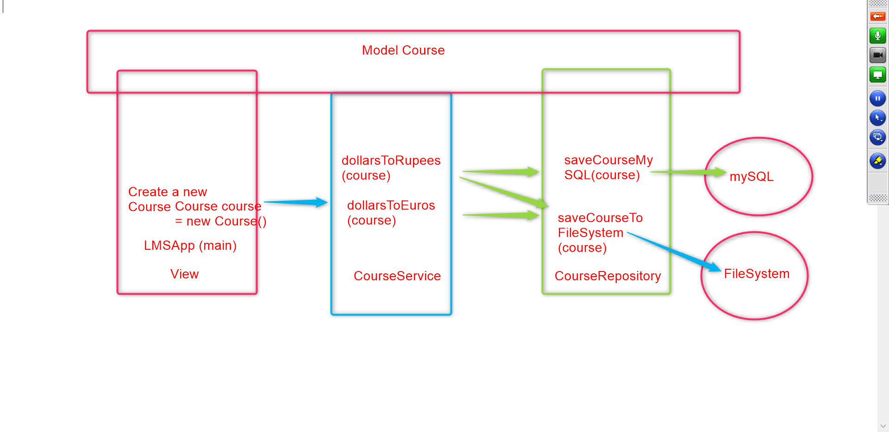

:beginner: **Application Architecture**

:newspaper: **Types of Architectures** ..

:page_with_curl: \_Monnolithic Architecture* ...

:heavy_minus_sign: Disadvantages

- Modification of code
- Length of the code
- Introduction new features
- Bad for reusability
- Super hard for testing
  Entire application is written in a single file.

:page_with_curl: Two Tier Architecture* ...

1. Front End
2. Back End

Client/Server

Java App / Mysql

:page_with_curl: \_Three Tier Architecture* ...

1. interact with user ()
2. processing (Buisness Logic)
3. storing (Persistence Logic, Stroring, Retrieving Data)

1) View Layer
2) Buisness Layer
3) Persistence Layer

:bell: Front End (View)  
:bell: Backend (Buisness)

:lock: Subramanian [Subbu] 
- Phase 1 Creation
1. Create the course class
2. Create the Course collections
3. Save the course collections
- Phase 2 Search
1. Enter course id and display details of the course.
- Phase 3: delete
1. enter the course id and delete
- Phase 4: update
1. enter course id 
2. fetch the course
3. modify the course 
4. save it.

:bulb: Boss, give me the picture?  
 
  

